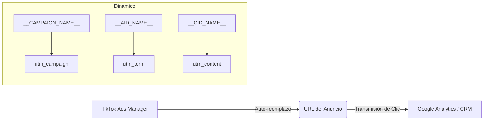

# 📊 Mapeo y Guía de Parámetros UTM en TikTok Ads

Esta guía documenta la estructura de seguimiento UTM utilizada en las campañas de **TikTok Ads Manager**, la diferencia entre parámetros estáticos y macros dinámicos, y cómo integrarlos correctamente para su lectura en plataformas como **Google Analytics (GA4)** o **Mixpanel**.

---

## 📌 1. Diferencia: UTMs Estándar vs. Macros Dinámicos

> [!NOTE] Concepto clave
> La diferencia principal radica en **cuándo y cómo se asigna el valor** al parámetro UTM dentro del enlace publicitario.

| Característica | UTMs Estáticos / Estandarizados | Macros Dinámicos de TikTok |
| :--- | :--- | :--- |
| **Definición** | Valores definidos manualmente de forma fija por el usuario. | Variables delimitadas por guiones bajos dobles (`__VARIABLE__`) que TikTok completa automáticamente al hacer clic. |
| **Ejemplo** | `utm_source=tiktok` | `utm_campaign=__CAMPAIGN_NAME__` |
| **Ventaja** | Mantiene consistencia y evita discrepancias de nomenclatura en analítica. | Evita errores manuales de tipeo y ahorra tiempo al no tener que cambiar la URL en cada anuncio. |
| **Desventaja** | Requiere crear URLs personalizadas únicas para cada combinación de anuncio/audiencia. | Si cambias el nombre de la campaña o conjunto de anuncios en TikTok Ads Manager, el valor transmitido en el clic cambiará a partir de ese momento. |
| **Uso Recomendado** | **`utm_source`**, **`utm_medium`** | **`utm_campaign`**, **`utm_term`**, **`utm_content`** |

---

## 🗺️ 2. Mapeo de Parámetros en TikTok Ads

A continuación se detalla la correspondencia recomendada entre los parámetros estándar de atribución y los macros disponibles en TikTok Ads Manager:



### Tabla de Mapeo Detallada

| Parámetro UTM | Tipo Sugerido | Valor Recomendado / Macro | Descripción del Campo |
| :--- | :--- | :--- | :--- |
| **`utm_source`** | Estático | `tiktok` o `tiktok_ads` | Identifica la plataforma o red de origen. Mantenlo en minúsculas. |
| **`utm_medium`** | Estático | `cpc` o `paid_social` | Identifica el canal de tráfico de pago. |
| **`utm_campaign`** | Dinámico | `__CAMPAIGN_NAME__` | Captura el nombre exacto de la Campaña en TikTok. |
| **`utm_term`** | Dinámico | `__AID_NAME__` | Captura el nombre del Grupo de Anuncios (*Ad Group* / Audiencia). |
| **`utm_content`** | Dinámico | `__CID_NAME__` | Captura el nombre de la Variante / Creativo (*Ad/Creative*). |

---

## 🔍 3. Lista Completa de Macros Dinámicos Oficiales

TikTok admite los siguientes macros que puedes intercalar en tus URLs:

> [!TIP] Macros Disponibles
> - **`__CAMPAIGN_NAME__`**: Nombre de la campaña.
> - **`__CAMPAIGN_ID__`**: ID numérico de la campaña.
> - **`__AID_NAME__`**: Nombre del grupo de anuncios (*Ad Group Name*).
> - **`__AID__`**: ID numérico del grupo de anuncios (*Ad Group ID*).
> - **`__CID_NAME__`**: Nombre del anuncio/creativo (*Creative Name*).
> - **`__CID__`**: ID numérico del anuncio/creativo (*Creative ID*).
> - **`__PLACEMENT__`**: Ubicación exacta donde se sirvió el anuncio (ej. *TikTok*, *Pangle*).
> - **`__ADID_V2_NAME__`**: Nombre del anuncio (Específico para campañas **Smart+**).
> - **`__ADID_V2__`**: ID del anuncio (Específico para campañas **Smart+**).

---

## ⚙️ 4. Plantillas de Configuración Ready-to-Use

### Opción A: Cadena Completa para la URL (Estándar recomendado)
Copia esta cadena directamente en la casilla de **Parámetros de URL** (*URL Parameters*) al configurar el anuncio:

```text
utm_source=tiktok&utm_medium=paid_social&utm_campaign=__CAMPAIGN_NAME__&utm_term=__AID_NAME__&utm_content=__CID_NAME__
```

### Opción B: Cadena con Identificadores por ID (Ideal para evitar cambios al renombrar)
Si sueles renombrar tus campañas o grupos de anuncios constantemente en TikTok, usa IDs para mantener la consistencia histórica en tus bases de datos:

```text
utm_source=tiktok&utm_medium=paid_social&utm_campaign=__CAMPAIGN_ID__&utm_term=__AID__&utm_content=__CID__
```

---

## 🛠️ 5. Pasos para Implementar en TikTok Ads Manager

1. Ve a nivel de **Anuncio (Ad Level)** en el administrador de anuncios.
2. Ingresa la dirección principal de tu sitio web en **URL de destino** (ej. `https://tusitio.com/landing`).
3. En la sección **Parámetros de URL** (*URL Parameters*):
   - Pega directamente la cadena de parámetros sin el signo `?` inicial.
   - O utiliza el botón **Construir parámetros de URL** (*Build URL parameters*) y asigna cada clave con su respectivo macro.
4. **Prueba de visualización:** Revisa la previsualización del enlace para asegurarte de que los parámetros queden separados por `&`.

> [!WARNING] Advertencia sobre Mayúsculas y Espacios
> Google Analytics 4 es **sensible a mayúsculas y minúsculas** (*case-sensitive*). Si tus campañas en TikTok están escritas como `PROMO_VERANO` y otras como `Promo_Verano`, GA4 las interpretará como dos campañas distintas. Asegúrate de estandarizar la nomenclatura dentro de TikTok Ads Manager.

---

## 📚 6. Referencias Oficiales
- [TikTok Business Help Center - How to add URL parameters to your website URL](https://ads.tiktok.com/resources/help/article/how-to-add-url-parameters-to-your-website-url-in-tiktok-ads-manager?lang=es)
- [TikTok Business Help Center - Track Offsite Web Events with UTM Parameters](https://ads.tiktok.com/resources/help/article/track-offsite-web-events-with-utm-parameters)